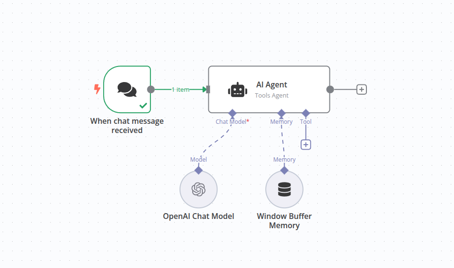
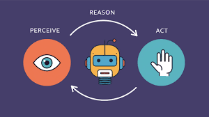
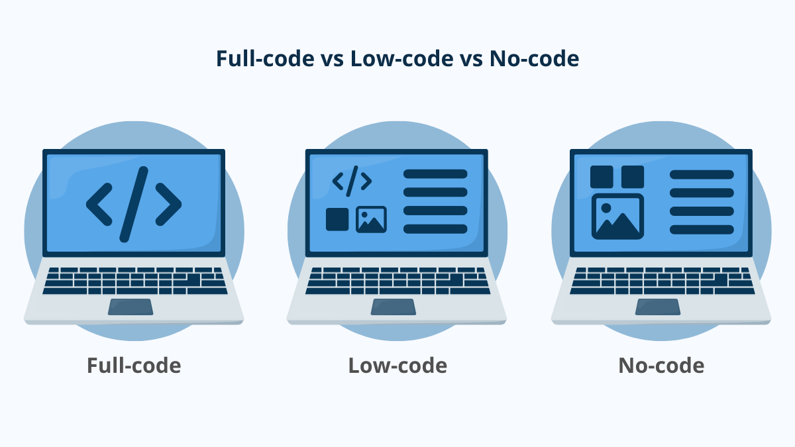

n8n (pronounced “n-eight-n”) is an open‑source workflow automation, Agentic AI, and orchestration platform. It lets you build AI Agents and connect APIs, databases, and services with a visual, node‑based editor, while still giving you the power to drop into code when you need it. For agentic AI, that combination—no‑code orchestration with just‑enough code—makes n8n an ideal control plane for prototyping and building systems that can perceive, plan, and act across tools.

### What are AI Agents?
 

LLM (the brain) + tools/APIs (hands) + memory (long-term context) + goals (what to achieve) + a loop (to try, check, and try again).

### What n8n is (in agent terms)
n8n is a visual workflow orchestrator. You drag-and-drop nodes to let an AI model (the “brain”) use tools (APIs, databases, vector stores), manage memory, and include humans when needed. In other words, you build agents that can perceive → decide → act across your stack. n8n ships AI/LLM nodes (OpenAI, embeddings, chat), tool nodes (HTTP Request, Slack, etc.), and “agent” patterns out of the box.

### Mental model (simple)
---
1. Trigger (manual, schedule, webhook, Slack).
2. Plan/decide (LLM node).
3. Act (tool nodes like HTTP, DB, Drive, Slack).
4. Remember (Chat Memory / vector store).
5. Verify/HITL (approval or guardrail step).
6. Loop until the goal is met or a stop condition is reached.

### Common use cases for beginners
* AI helpdesk or chatbot that reads docs (vector store), answers, and escalates to a human on low confidence. ([n8n Docs][3])
* Report generator: fetch API/DB data (HTTP), summarize with LLM, export CSV/XLSX, send to Slack/email with an approval step. ([n8n Docs][6])
* Research assistant: scrape pages, chunk & embed to Pinecone/Qdrant, then chat over the corpus. ([n8n Docs][9])

### No-Code, Low-code, and Full-code
 
